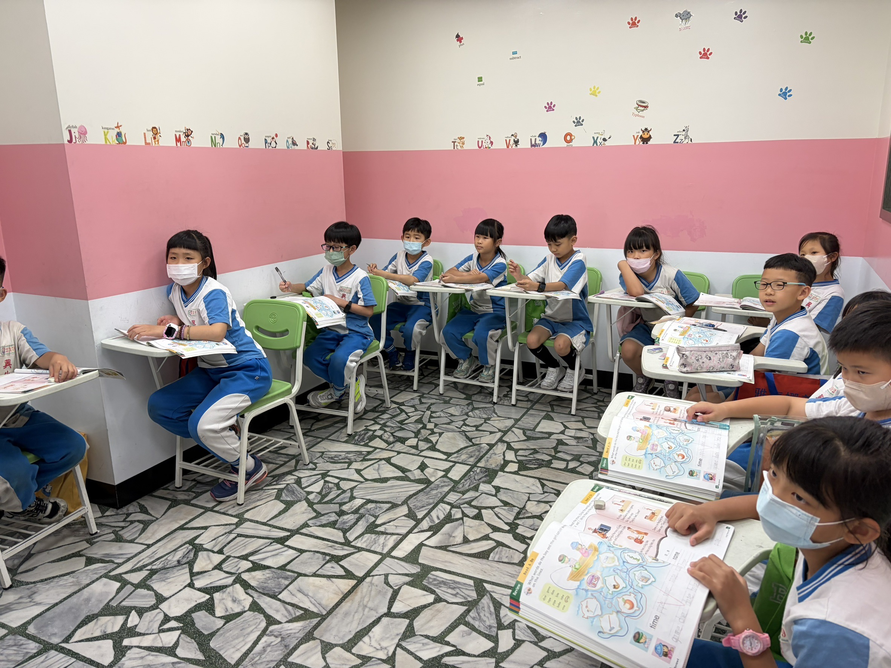

<div align="center">
  <picture>
    <source media="(prefers-color-scheme: dark)" srcset="athena-netlify-site/assets/favicon.svg">
    
  </picture>

  # 雅喜娜美語補習班 · Athena Language School

  **讓孩子愛上說 English！** — 新北市新莊區專業兒童美語補習班

  <br>

  [](https://app.netlify.com/sites/athena-language-school/deploys)
  [](https://123athena.com)
  [](https://developer.mozilla.org/en-US/docs/Web/HTML)
  [](https://developer.mozilla.org/en-US/docs/Web/CSS)
  [](https://developer.mozilla.org/en-US/docs/Web/JavaScript)
  [](https://decapcms.org)
  [](https://docs.netlify.com/visitor-access/identity/)
  [](https://123athena.com)
  [](LICENSE)

  <br>
  
</div>

---

## 📋 Table of Contents

- [Overview](#-overview)
- [Features](#-features)
- [Tech Stack](#-tech-stack)
- [Project Structure](#-project-structure)
- [Getting Started](#-getting-started)
- [Content Management](#-content-management)
- [Deployment](#-deployment)
- [SEO & Performance](#-seo--performance)
- [Roadmap](#-roadmap)
- [License](#-license)

---

## 📖 Overview

Athena Language School (雅喜娜美語補習班) is a children's English-language school in **Xinzhuang District, New Taipei City, Taiwan**. This repository contains its official marketing website — a fast, responsive, bilingual (Traditional Chinese / English) static site designed to:

- Introduce the school's courses and teaching team to prospective parents
- Build trust through teacher profiles, classroom photos, and a clear value proposition
- Drive **free trial class** sign-ups via an integrated enquiry form
- Provide an interactive **grammar mini-game** for current students to practice at home

The site is hand-built with vanilla HTML, CSS, and JavaScript — no framework, no build step, no runtime dependencies. Content is managed through **Decap CMS** (formerly Netlify CMS) with username/password authentication via **Netlify Identity**, so the school staff can update text and images without touching code.

---

## ✨ Features

| Feature | Description |
|---|---|
| **Bilingual content** | Traditional Chinese with English highlights, written for Taiwanese families |
| **Course showcase** | Four age-group programs (ages 4–15) with descriptions and age ranges |
| **Teacher profiles** | Individual cards with photos, names, titles, and bios for each instructor |
| **Free-trial sign-up** | Netlify Forms-powered enquiry form with dedicated confirmation page |
| **Interactive grammar game** | Self-contained word-ordering mini-game for student practice |
| **LINE integration** | Direct contact via LINE QR code — Taiwan's primary messaging channel |
| **Responsive design** | Mobile-first layout optimized for phones, tablets, and desktops |
| **CMS backend** | Decap CMS admin panel at `/admin/` — edit content with username + password |
| **SEO optimized** | JSON-LD structured data, sitemap, robots.txt, Open Graph tags, canonical URLs |

---

## 🛠 Tech Stack

| Layer | Technology |
|---|---|
| **Markup & Styling** | HTML5, CSS3 (vanilla, no framework) |
| **Interactivity** | Vanilla JavaScript (ES6+) |
| **Content Management** | [Decap CMS](https://decapcms.org) v3 |
| **Authentication** | [Netlify Identity](https://docs.netlify.com/visitor-access/identity/) (username + password) |
| **Git Gateway** | [Netlify Git Gateway](https://docs.netlify.com/visitor-access/git-gateway/) (commits CMS changes to GitHub) |
| **Forms** | [Netlify Forms](https://docs.netlify.com/forms/setup/) |
| **Hosting** | [Netlify](https://www.netlify.com) |
| **Domain** | `123athena.com` (GoDaddy → Netlify DNS) |

---

## 📂 Project Structure

```
athena-language-school/
├── athena-netlify-site/          # Production deploy directory
│   ├── index.html                # Main landing page
│   ├── grammar-game.html         # Interactive grammar mini-game
│   ├── success.html              # Form-submission confirmation page
│   ├── robots.txt                # Crawl instructions for search engines
│   ├── sitemap.xml               # XML sitemap for Google indexing
│   ├── content-loader.js         # Client-side JS: fetches JSON → populates DOM
│   ├── admin/
│   │   ├── index.html            # Decap CMS entry point (branded login)
│   │   └── config.yml            # CMS collection definitions
│   ├── content/                  # Editable JSON data files (CMS-managed)
│   │   ├── hero.json
│   │   ├── features.json
│   │   ├── courses.json
│   │   ├── teachers.json
│   │   └── contact.json
│   └── assets/                   # Static assets
│       ├── favicon.svg           # School owl logo
│       ├── hero-*.jpg            # Hero / classroom photographs
│       ├── teacher-*.png         # Teacher portraits
│       └── line-qr.png           # LINE contact QR code
├── .gitignore
├── CHANGELOG.md
├── LICENSE
└── README.md                     # This file
```

---

## 🚀 Getting Started

### Prerequisites

- A modern web browser (Chrome, Firefox, Safari, Edge)
- (Optional) [Python 3](https://python.org) or [Node.js](https://nodejs.org) for local preview

### Local Preview

```bash
git clone https://github.com/douglasalfaro/athena-language-school.git
cd athena-language-school/athena-netlify-site

# Option A: Python
python3 -m http.server 8000
# → http://localhost:8000

# Option B: Node.js (npx)
npx serve .
# → http://localhost:3000
```

> The site is fully static — no build step, no environment variables, no database required.

---

## 📝 Content Management

The school staff can edit website content through a browser-based admin panel:

1. Visit **https://123athena.com/admin/**
2. Log in with the school's Netlify Identity credentials (username + password)
3. Edit text, images, teacher bios, course descriptions, and contact info
4. Click **Publish** — changes are committed to GitHub and deployed automatically

### Editable Collections

| Collection | Fields |
|---|---|
| **Hero** | Headline, subtitle, background image, CTA text |
| **Features** | Feature cards (icon, title, description) — add / remove / reorder |
| **Courses** | Course name, age range, description, highlights — add / remove / reorder |
| **Teachers** | Name, title, bio, photo — add / remove / reorder |
| **Contact** | Address, phone, email, LINE QR, business hours |

---

## 🚢 Deployment

The site is hosted on **Netlify** and deployed from the `athena-netlify-site/` directory.

| Method | Trigger |
|---|---|
| **Git push** | Pushing to `master` triggers an automatic Netlify build |
| **CLI** | `npx netlify-cli deploy --prod --dir=athena-netlify-site` |
| **CMS publish** | Publishing in Decap CMS commits to GitHub → auto-deploys |

**Live URL:** [https://123athena.com](https://123athena.com)

---

## 🔍 SEO & Performance

The site is optimized for local search in the Xinzhuang / New Taipei City area:

- **JSON-LD structured data** — `LocalBusiness` schema with address, phone, hours, and course catalog for rich Google results
- **XML sitemap** — submitted to Google Search Console for full page discovery
- **`robots.txt`** — crawl instructions for all major search engines
- **Open Graph tags** — `og:title`, `og:description`, `og:image`, `og:url` for social sharing
- **Canonical URLs** — prevents duplicate content penalties
- **Semantic HTML** — `section`, `nav`, `header`, `footer` with meaningful `id` attributes
- **Lazy-loaded images** — `loading="lazy"` on below-the-fold assets
- **Responsive images** — viewport-aware layout with CSS media queries
- **Google Search Console** — property verified, sitemap submitted, indexing requested

---

## 🗺 Roadmap

- [x] Core landing page with courses, teachers, and contact
- [x] Interactive grammar mini-game
- [x] Decap CMS integration with Netlify Identity
- [x] Custom domain (123athena.com) with Netlify DNS
- [x] SEO essentials (sitemap, robots.txt, JSON-LD, OG tags)
- [ ] Google Analytics or Plausible for conversion tracking
- [ ] Image optimization (WebP conversion, responsive srcset)
- [ ] Performance audit (Lighthouse score targets: 90+)
- [ ] Blog / news section for school announcements

---

## 📄 License

**Proprietary** — All rights reserved. See [LICENSE](LICENSE).

The website content, branding, school photographs, and teacher portraits are proprietary and may not be reused without written permission.

---

<div align="center">
  <sub>Built with ❤️ for Athena Language School · 雅喜娜美語補習班</sub>
  <br>
  <sub>新北市新莊區五工三路78巷12號 · <a href="tel:+886-2-2298-8881">02-2298-8881</a></sub>
</div>
